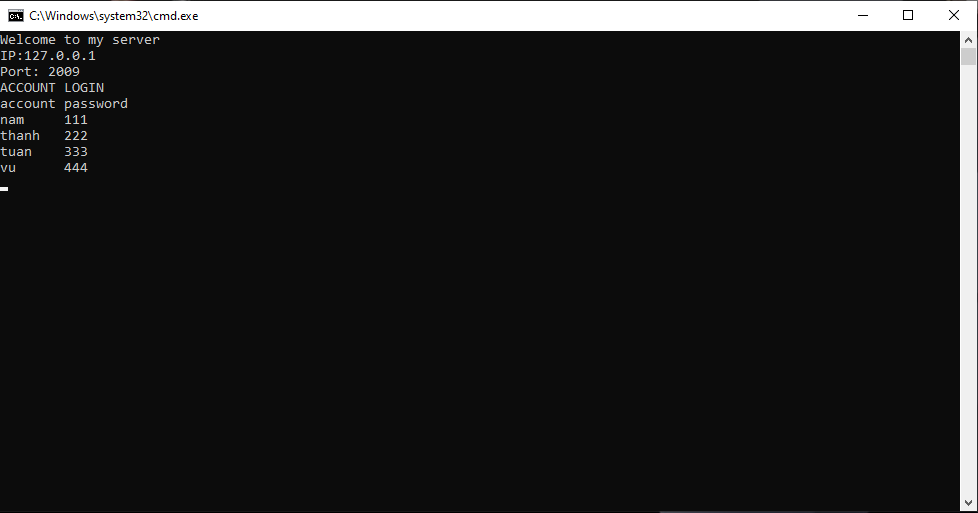
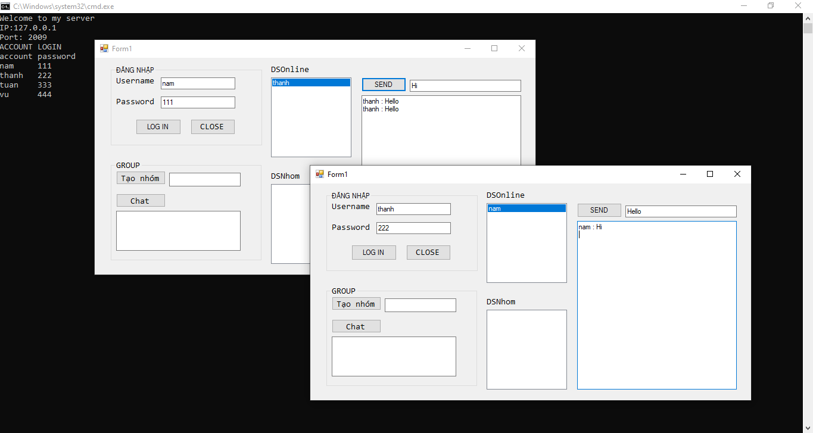
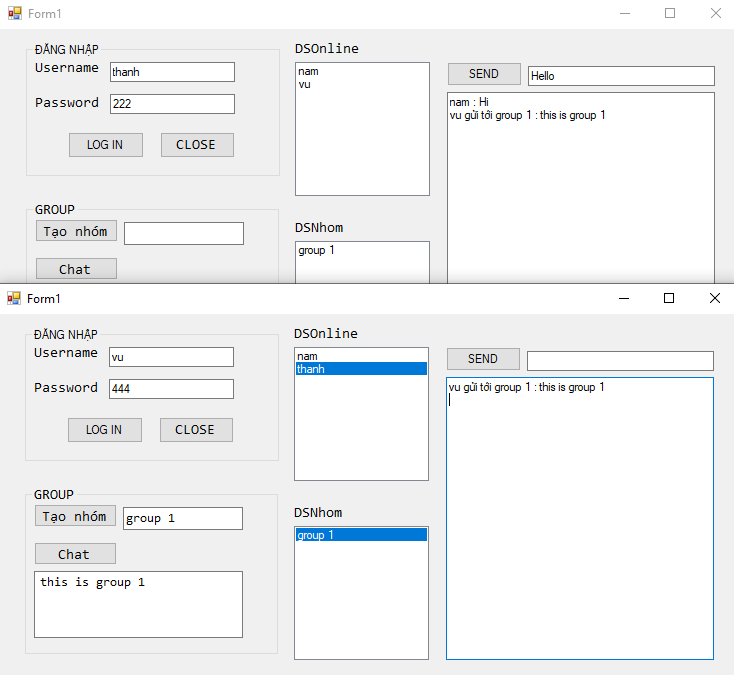

<!-- PROJECT LOGO -->
<br />
<p align="center">
  <h1 align="center">Chat Application C# Winform </h1>
  
  

<!-- TABLE OF CONTENTS -->
<details open="open">
  <summary>Table of Contents</summary>
  <ol>
    <li>
      <a href="#about-the-project">About The Project</a>
      <ul>
        <li><a href="#overview">Overview</a></li>
		<li><a href="#expected-behavior">Expected Behavior</a></li>
		<li><a href="#project-structure">Project Structure</a></li>
      </ul>
    </li>
	<li><a href="#comments">Comments</a></li>
    <li><a href="#contact">Contact</a></li>
    <li><a href="#references">References</a></li>
  </ol>
</details>


<!-- ABOUT THE PROJECT -->
## About The Project

This project is built on Visual Studio 2017 using C# language (winform) when I was in 3rd year at Saigon University.

### Overview
Project is implemented on the same computer with the computer's IP is 127.0.0.1, to be implemented on many different computers need to change this IP.

### Expected Behavior
<p>
File server execute should be run first to set up server, at the console interface will appear 3 pre-registered account information.
<p align="center">
  
</p>
Run client execute three times corresponding to three accounts and login. After login, now the clients were able to communicate with each other. 
<p align="center">
  
  
</p>


### Project Structure

```
├── README.md              			: Description of project
├── images              			: Folder contains images of project
      ├── img1.png
      ├── img2.png
      ├── img3.png
      ├── img4.png
├── Client         			
      ├── bin\Debug\Client.exe  : File client execute (run this after Server.exe)
├── Server					
      ├── bin\Debug\Server.exe  : File server execute (run this first)
├── WebSocketClient			
      ├── Source
├── WebSocketServer			
├── packages				
├── TCPChat.sln

```

<!-- GETTING STARTED -->
## Comments
File server.exe should be run before file client.exe has run.

<!-- CONTACT -->
## Contact

Author - [PHAM NGUYEN QUOC HUNG](https://hun9pham.github.io) - hungpham99er@gmail.com

Project Link: [Souce code](https://github.com/hun9pham/chat-application-csharp-winform.git)

## References

